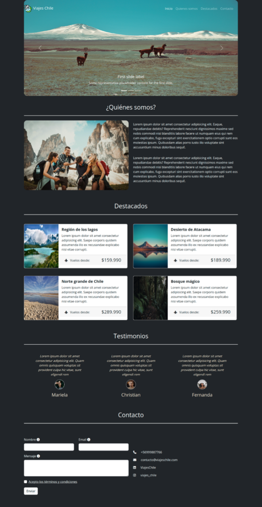

# Viajes Chile 
## Versión actualizada

En este desafío se ha utilizado Bootstrap como framework de CSS, complementado con Sass para el preprocesamiento de estilos. Además, se ha implementado la metodología BEM (Block Element Modifier) para una estructura de código más mantenible y organizada.

Esta es la maqueta:

